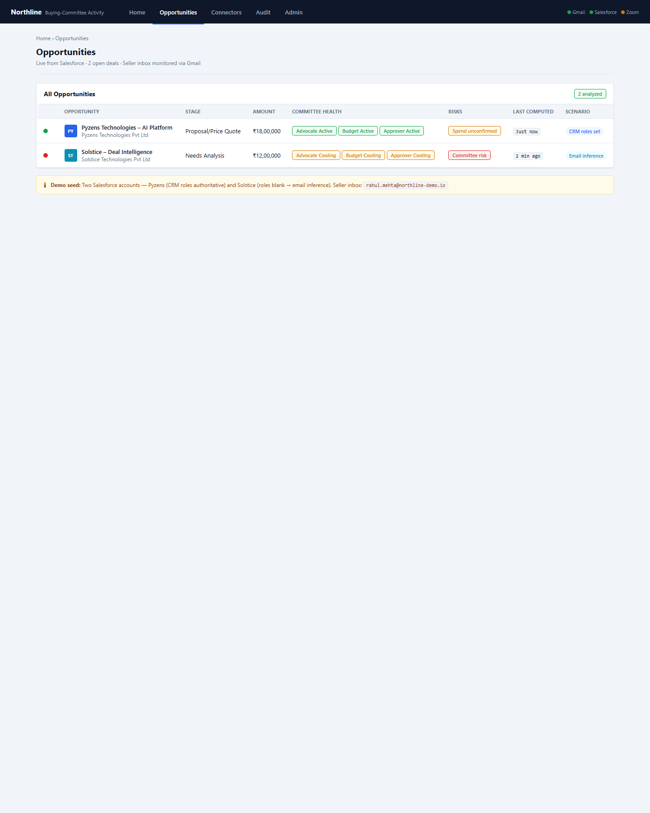
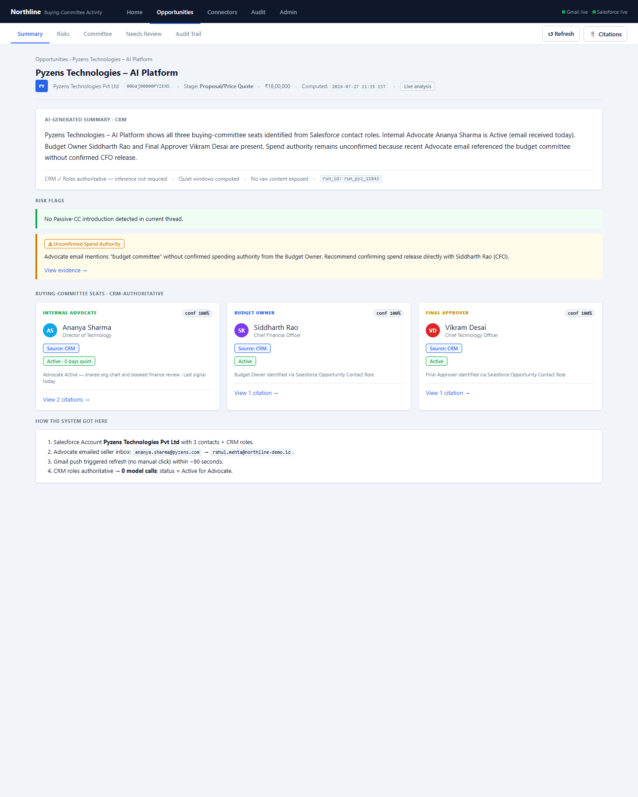
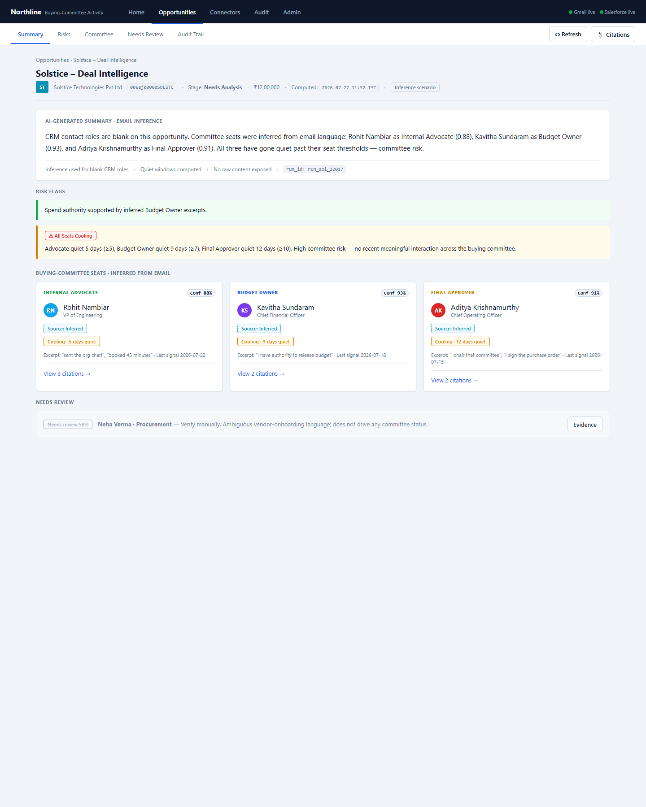
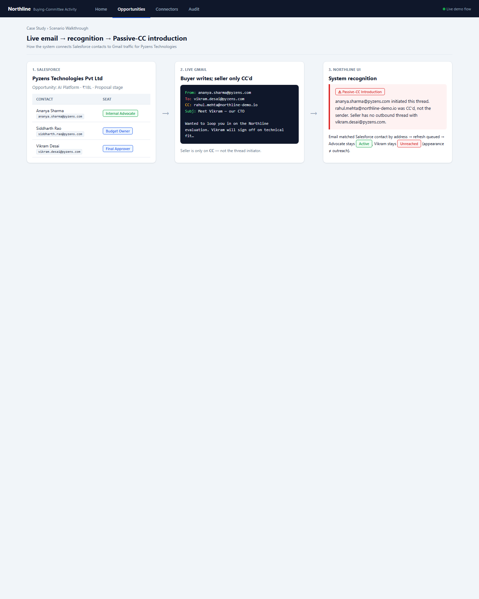

# Case Study 009: Buying-Committee Activity Intelligence with Live Multi-System Orchestration

| Field | Value |
|-------|-------|
| **Case** | 009 |
| **Client / Capability Owner** | Northline |
| **Industry** | Enterprise Sales Technology / Revenue Intelligence |
| **Capability** | Buying-Committee Activity Intelligence |
| **Engagement Type** | Working proof-of-concept (live-demonstrable) |
| **Timeline** | Architecture lock through live acceptance demo (approx. 3 delivery phases / 5 sprints) |
| **Primary Audience** | CROs, RevOps leaders, sales enablement, and technical evaluators assessing AI-assisted deal-risk signals |
| **Status** | Publication-ready |
| **UI screenshots** | [`screenshots/`](./screenshots/) |

### Publish-safe role glossary

This case study uses plain commercial language for buying-committee roles and risk patterns. It does **not** reuse proprietary or specification-specific labels.

| Role in this case study | What it means commercially |
|-------------------------|----------------------------|
| **Budget Owner** | Controls or confirms release of spend for the deal |
| **Internal Advocate** | Active insider who advances the evaluation (intros, materials, meetings) |
| **Final Approver** | Person who can clear or block fit / process approval |
| **Passive-CC introduction** | A new stakeholder appears on a thread where the seller is only CC’d — not the same as seller outreach |
| **Unconfirmed spend authority** | Activity looks strong, but no one has clearly confirmed budget release |
| **Active / Cooling / Unreached** | Recent contact · silence past role-specific quiet window · no meaningful seller reach |

---

## Executive Summary

Enterprise deals stall when buying committees are incomplete or silent — yet most CRM systems only record who was *named*, not whether they are *active*. Northline commissioned a working proof-of-concept to detect, in real time, whether three critical committee seats on an active opportunity — Budget Owner, Internal Advocate, and Final Approver — are filled and showing recent, meaningful interaction across Gmail and Salesforce (mandatory), with Zoom as an optional signal source.

The delivered system orchestrates read-only OAuth connectors, ephemeral in-memory processing, language-model-assisted role inference when CRM roles are unset, and a structured findings store that keeps only derived conclusions and short supporting excerpts. The demonstration uses two named buyer organizations and a logged email trail into the seller’s monitored inbox — **Pyzens Technologies Pvt Ltd** (healthy: CRM roles set; Internal Advocate Ananya Sharma emails the seller directly) and **Solstice Technologies Pvt Ltd** (at risk: blank CRM roles; roles inferred from Rohit / Kavitha / Aditya emails that later go quiet).

Results validated the approach end to end: live email ingestion refreshed findings within minutes without manual intervention; Salesforce role edits flipped identification from CRM-authoritative to inferred (or unreached) on the next refresh; role-specific quiet windows (7 / 5 / 10 days) surfaced committee risk that a single deal-level “stale” flag would have hidden; Passive-CC introduction detection correctly separated seller-initiated outreach from being copied on someone else’s thread; scores below 0.70 were held for manual review and excluded from status calls; and identical refreshes completed in well under 30 seconds with stable, repeatable output.

> *"When a Budget Owner, Internal Advocate, or Final Approver is missing from meaningful interaction, that is committee risk — not a minor CRM hygiene gap."*

---

## Company Background

Northline builds AI capabilities for enterprise deal-flow intelligence. The capability under study does not replace CRM; it answers a sharper question: *for an active opportunity, who sits in the critical committee seats, and are they actually interacting?*

Industry context makes the problem urgent. B2B buying committees commonly involve eight or more stakeholders. Single-threaded deals close at roughly half the rate of multi-threaded ones; internal advocates change roles mid-cycle; and sellers routinely confuse a vocal advocate with the person who can release budget.

The POC was scoped as a **live, hands-on demonstration**: vendor-provisioned sandboxes, synthetic but coherent deal history, and a live flow in which an evaluator sends email and edits Salesforce while the system refreshes on infrastructure the vendor operates.

---

## Challenge Analysis

### The business problem

Closing enterprise software deals typically requires three committee seats to be both identified and active:

| Committee seat | Mandate | Typical miss |
|----------------|---------|--------------|
| **Budget Owner** | Controls or confirms spend release | Mistaken for a vocal Internal Advocate |
| **Internal Advocate** | Insider who *acts* (intros, org charts, bookings) | Fans who go quiet after demos |
| **Final Approver** | Can clear or block fit / process approval | Vague “we’ll get buy-in” language |

In some accounts one person holds multiple seats; in others they are separate. Either way, **missing or silent seats are committee risk**.

### Operational failure modes the POC had to address

1. **Incomplete CRM roles** — Roles often unset early in the cycle; teams need inference from communication, not a blank risk map.
2. **Passive-CC introduction** — An Internal Advocate introduces a senior stakeholder while the AE is only CC’d; sellers treat address appearance as outreach. Being CC’d is not an outbound touch.
3. **Unconfirmed spend authority** — Strong advocate activity without confirmed budget release must surface an explicit flag, not a silent assumption.
4. **Blind quiet periods** — Quiet windows differ by seat (Budget Owner > 7 days, Internal Advocate > 5, Final Approver > 10); a single deal-wide “stale” flag hides which relationship went dark.
5. **Trust and compliance** — Findings without confidence and citations cannot drive coaching; raw email bodies and transcripts must not be stored.

### Impact if unsolved

Without automated detection, managers discover missing Budget Owners in late-stage reviews, forecast accuracy erodes, and AEs waste cycles on deals that were never multi-threaded. For Northline’s evaluation panel, an unverifiable demo (cached data, manual uploads, opaque AI claims) would fail regardless of UI polish.

---

## Organizations, Contacts & Communications

The POC is grounded in a concrete commercial story: **one seller**, **two buyer organizations** in Salesforce, **named contacts**, and a **logged email trail** into a single monitored inbox.

### Parties at a glance

| Side | Organization / mailbox | Role |
|------|------------------------|------|
| **Seller (Northline AE)** | Monitored Gmail: `rahul.mehta@northline-demo.io` | Account executive inbox — every buyer email lands here |
| **Buyer org 1** | **Pyzens Technologies Pvt Ltd** | Healthy CRM path — roles set in Salesforce |
| **Buyer org 2** | **Solstice Technologies Pvt Ltd** | Inference path — Salesforce roles blank; seats inferred from email |



*Figure 1. Portfolio view: Organization 1 (Pyzens — healthy) and Organization 2 (Solstice — at risk) after email recognition.*

### Cast of systems

| System | Role in the demo |
|--------|------------------|
| **Salesforce Dev Org** | Accounts, Opportunities, Contacts, Opportunity Contact Roles |
| **Gmail (buyer mailboxes)** | Synthetic buyer addresses that send the emails below |
| **Gmail (seller inbox)** | `rahul.mehta@northline-demo.io` — ingestion target |
| **Northline Demo UI** | Opportunity list + committee activity dashboard |

### Full email roster (all addresses used)

| # | Organization | Person | Email | Expected committee seat | Opportunity |
|---|--------------|--------|-------|-------------------------|-------------|
| — | Seller (Northline) | Rahul Mehta (AE) | `rahul.mehta@northline-demo.io` | — (monitored inbox) | Both |
| 1 | Pyzens Technologies | Ananya Sharma | `ananya.sharma@pyzens.com` | Internal Advocate | Opp-1 |
| 2 | Pyzens Technologies | Siddharth Rao | `siddharth.rao@pyzens.com` | Budget Owner | Opp-1 |
| 3 | Pyzens Technologies | Vikram Desai | `vikram.desai@pyzens.com` | Final Approver / Passive-CC intro | Opp-1 |
| 4 | Solstice Technologies | Rohit Nambiar | `rohit.nambiar@solstice-tech.io` | Internal Advocate (inferred) | Opp-2 |
| 5 | Solstice Technologies | Kavitha Sundaram | `kavitha.sundaram@solstice-tech.io` | Budget Owner (inferred) | Opp-2 |
| 6 | Solstice Technologies | Aditya Krishnamurthy | `aditya.k@solstice-tech.io` | Final Approver (inferred) | Opp-2 |
| 7 | Solstice Technologies | Neha Verma | `neha.verma@solstice-tech.io` | Procurement (needs review) | Opp-2 |

---

### Organization 1 — Pyzens Technologies Pvt Ltd

#### Organization profile

| Field | Value |
|-------|-------|
| **Organization name** | Pyzens Technologies Pvt Ltd |
| **Industry** | Financial Services |
| **Website** | https://pyzens.com |
| **Billing city / country** | Pune, India |
| **Salesforce opportunity** | Pyzens Technologies – AI Platform |
| **Stage** | Proposal/Price Quote |
| **Close date** | 2026-10-31 |
| **Amount** | ₹18,00,000 |
| **Probability** | 45% |
| **Deal narrative** | Enterprise deal-flow intelligence evaluation. Three stakeholders identified. Internal Advocate engaged weekly. Budget review with CFO scheduled for Q3. |
| **Scenario purpose** | **Healthy case** — CRM roles fully set; live email keeps Internal Advocate active |

#### Contacts (Salesforce Opportunity Contact Roles)

| Name | Title | Department | Phone | Email | Role on opportunity | Primary? |
|------|-------|------------|-------|-------|---------------------|----------|
| **Ananya Sharma** | Director of Technology | Technology | +91 98201 11101 | `ananya.sharma@pyzens.com` | **Internal Advocate** | Yes |
| **Siddharth Rao** | Chief Financial Officer | Finance | +91 98201 11102 | `siddharth.rao@pyzens.com` | **Budget Owner** | No |
| **Vikram Desai** | Chief Technology Officer | Technology | +91 98201 11103 | `vikram.desai@pyzens.com` | **Final Approver** | No |

#### Communication emails — Pyzens ↔ Seller

**Email P1 — Internal Advocate follow-up (live / healthy activity signal)**

| Header | Value |
|--------|-------|
| From | `ananya.sharma@pyzens.com` (Ananya Sharma, Internal Advocate) |
| To | `rahul.mehta@northline-demo.io` (seller) |
| Date | Demo day (live send) |
| Subject | Following up — shared org chart and booked finance review |

```
Hi,

Quick update from my side:

I've sent the pricing one-pager to our budget committee and shared
the org chart you requested last week. I also booked 30 minutes with
our finance lead for this Thursday at 3 PM.

Happy to be the internal point of contact and drive this forward.
Let me know if you need anything else before the CFO briefing.

Best regards,
Ananya Sharma
Director of Technology
Pyzens Technologies Pvt Ltd
```

| What the system recognizes | Outcome |
|----------------------------|---------|
| From-address matches Salesforce contact Ananya | Linked to Opp-1 |
| CRM Role = Internal Advocate | Source: CRM, confidence **1.00** (no model call) |
| “org chart”, “booked … finance lead”, “internal point of contact” | Advocate activity reinforced |
| “budget committee” | **Unconfirmed spend authority** flagged |
| Message timestamp = today | Internal Advocate status **Active**, 0 days quiet |

**Email P2 — Passive-CC introduction (Final Approver appears, seller only CC’d)**

| Header | Value |
|--------|-------|
| From | `ananya.sharma@pyzens.com` (Internal Advocate initiates) |
| To | `vikram.desai@pyzens.com` (Final Approver introduced) |
| CC | `rahul.mehta@northline-demo.io` (seller — passive) |
| Subject | Meet Vikram — our CTO |

```
Hi Vikram,

Wanted to loop you in on the Northline evaluation. Rahul is the account
executive leading the engagement from their side.

Vikram is our Chief Technology Officer and will be signing off on the
technical fit assessment before we proceed to contract.

Rahul — Vikram will need to see your security and compliance deck
before he can sponsor this to the investment committee.

Best,
Ananya
```

| What the system recognizes | Outcome |
|----------------------------|---------|
| Seller is on CC, not To / not From | **Passive-CC introduction** flagged |
| Vikram address appears but seller never initiated outbound | Final Approver not counted as seller-reached (**Unreached** for outreach) |
| Ananya still the thread initiator | Advocate activity remains valid |

**Email P3 — Optional pre-seeded CFO intro (backup Passive-CC pattern)**

| Header | Value |
|--------|-------|
| From | `ananya.sharma@pyzens.com` |
| To | `siddharth.rao@pyzens.com` |
| CC | `rahul.mehta@northline-demo.io` |
| Date | 2026-07-24 |
| Subject | Siddharth — introducing Rahul from Northline |

```
Hi Siddharth,

Wanted to introduce you to Rahul from Northline — they're the vendor
we've been evaluating for deal intelligence automation.

You're our CFO and will be approving the budget for this initiative.
Rahul, please send Siddharth your pricing summary when you get a chance.

Thanks,
Ananya
```

#### Why this is the “healthy” case

- All three committee seats exist in Salesforce with correct roles.
- Internal Advocate emailed the seller **directly** (P1) → genuine activity.
- UI shows healthy stakeholder status for Advocate / Budget Owner / Final Approver, with only unconfirmed spend authority as a coaching flag — not a collapsed committee.



*Figure 2. Healthy Pyzens deal: organization name, CRM-sourced contacts, and Internal Advocate email recognition in one dashboard.*

---

### Organization 2 — Solstice Technologies Pvt Ltd

#### Organization profile

| Field | Value |
|-------|-------|
| **Organization name** | Solstice Technologies Pvt Ltd |
| **Industry** | Technology |
| **Website** | https://solstice-tech.io |
| **Billing city / country** | Bengaluru, India |
| **Salesforce opportunity** | Solstice – Deal Intelligence |
| **Stage** | Needs Analysis |
| **Close date** | 2026-11-30 |
| **Amount** | ₹12,00,000 |
| **Probability** | 30% |
| **Deal narrative** | Early-stage evaluation. Three contacts identified but CRM roles not yet assigned by the sales team. System must infer committee seats from communication patterns. |
| **Scenario purpose** | **At-risk case** — roles blank; email inference + quiet windows expose silence |

#### Contacts (on opportunity, Role field left blank)

| Name | Title | Department | Email | Role on opportunity | Inferred seat (from email) |
|------|-------|------------|-------|---------------------|----------------------------|
| **Rohit Nambiar** | VP of Engineering | Engineering | `rohit.nambiar@solstice-tech.io` | *(blank)* | Internal Advocate (~0.88) |
| **Kavitha Sundaram** | Chief Financial Officer | Finance | `kavitha.sundaram@solstice-tech.io` | *(blank)* | Budget Owner (~0.93) |
| **Aditya Krishnamurthy** | Chief Operating Officer | Operations | `aditya.k@solstice-tech.io` | *(blank)* | Final Approver (~0.91) |
| **Neha Verma** | Senior Manager – Procurement | Procurement | `neha.verma@solstice-tech.io` | *(blank)* | Procurement (~0.58) — needs review only |

#### Communication emails — Solstice ↔ Seller

All messages are sent **To** `rahul.mehta@northline-demo.io`. Dates are seeded relative to demo day **2026-07-27** so quiet-window statuses fire correctly (Internal Advocate > 5 days, Budget Owner > 7, Final Approver > 10).

**Email A1 — Rohit Nambiar (Internal Advocate signals)**

| Header | Value |
|--------|-------|
| From | `rohit.nambiar@solstice-tech.io` |
| To | `rahul.mehta@northline-demo.io` |
| Date | 2026-07-22T10:30:00+05:30 |
| Subject | Quick update — sent the org chart and intro'd our data team lead |

```
Hi Rahul,

As promised, I've attached the internal org chart for our AI and Data team.
I also made an intro to Priya from our data engineering group — she'll
be your primary technical contact for the integration review.

I've booked 45 minutes with our operations lead for next Tuesday.
Happy to help move this forward however I can.

Let me know if there's anything else you need from my side.

Regards,
Rohit Nambiar
VP of Engineering, Solstice Technologies
```

| Supporting excerpts | Inference | Days quiet (as of 2026-07-27) | Status |
|---------------------|-----------|--------------------------------|--------|
| “sent the org chart”, “made an intro”, “booked 45 minutes” | Internal Advocate, conf ~0.88 | 5 | **Cooling** |

**Email A2 — Kavitha Sundaram (Budget Owner signals)**

| Header | Value |
|--------|-------|
| From | `kavitha.sundaram@solstice-tech.io` |
| To | `rahul.mehta@northline-demo.io` |
| Date | 2026-07-18T14:15:00+05:30 |
| Subject | Re: Pricing proposal — budget approval status |

```
Hi Rahul,

Thanks for sharing the revised pricing. I reviewed it with the board this morning.

I have authority to release budget up to ₹15 lakhs for this initiative,
and the Northline proposal falls within that envelope. I'll need final
sign-off from our MD for anything above that threshold, but for the
current scope this is within my approval authority.

Could you send me the MSA draft this week?

Best,
Kavitha Sundaram
CFO, Solstice Technologies
```

| Supporting excerpts | Inference | Days quiet | Status |
|---------------------|-----------|------------|--------|
| “I have authority to release budget”, “within my approval authority” | Budget Owner, conf ~0.93 | 9 | **Cooling** |

**Email A3 — Aditya Krishnamurthy (Final Approver signals)**

| Header | Value |
|--------|-------|
| From | `aditya.k@solstice-tech.io` |
| To | `rahul.mehta@northline-demo.io` |
| Date | 2026-07-15T09:45:00+05:30 |
| Subject | Internal approval process — what you need to know |

```
Hi,

To help you understand our procurement cycle:

After CFO approval, the purchase goes to a three-member Technical Review
Committee. I chair that committee, and I can tell you we evaluate on
integration complexity, vendor lock-in risk, and security compliance.

Our typical timeline after CFO greenlight is 2 weeks for a committee vote.
The vote requires a quorum of two of three members. Once we vote, I sign
the purchase order.

I'll need your security questionnaire before the committee can schedule
a review session.

Aditya Krishnamurthy
COO, Solstice Technologies
```

| Supporting excerpts | Inference | Days quiet | Status |
|---------------------|-----------|------------|--------|
| “I chair that committee”, “I sign the purchase order” (+ concrete process) | Final Approver, conf ~0.91 | 12 | **Cooling** |

**Email A4 — Neha Verma (ambiguous / needs review)**

| Header | Value |
|--------|-------|
| From | `neha.verma@solstice-tech.io` |
| To | `rahul.mehta@northline-demo.io` |
| Date | 2026-07-25T16:00:00+05:30 |
| Subject | Re: Vendor onboarding checklist |

```
Hi Rahul,

Thanks for the form. I'll need to review the standard vendor agreement
with our legal team. Once that's cleared I can add you to our approved
vendor list.

Neha
```

| Supporting excerpts | Inference | Confidence gate |
|---------------------|-----------|-----------------|
| “review the standard vendor agreement” | Procurement / unclear | **0.58 &lt; 0.70** → needs manual review only; does **not** set committee status |

**Email A5 — Early engagement (historical, does not override last signal)**

| Header | Value |
|--------|-------|
| From | `rohit.nambiar@solstice-tech.io` |
| To | `rahul.mehta@northline-demo.io` |
| Date | 2026-07-01T09:00:00+05:30 |
| Subject | Initial call recap — next steps |

```
Great to connect today. Happy to set up a deeper technical review.
Attached is a summary of our current stack.

Rohit
```

Shows the deal once had momentum; last meaningful interaction for Internal Advocate remains **2026-07-22**, not July 1.

#### Why this is the at-risk contrast case

- Organization and contacts exist in Salesforce, but **roles were never filled**.
- System still names Internal Advocate / Budget Owner / Final Approver from email language.
- All three have gone quiet past seat-specific windows → portfolio shows **committee risk**.



*Figure 3. Solstice Technologies: organization + inferred contacts from the emails above; all three seats Cooling; Neha held under Needs Review.*

---

## Demo Scenario Walkthrough

With organizations, contacts, and emails established, the product story is: **match communication to CRM people → identify committee seats → score activity → surface risk**.

### How recognition works (end-to-end)

1. Buyer contact sends email from their corporate address (tables above).
2. Message arrives in seller inbox `rahul.mehta@northline-demo.io`.
3. Gmail push notifies the platform (hands-off; no polling auto-refresh).
4. Ingestion matches participants to Salesforce Contacts on the open opportunity.
5. **If CRM Role is set** (Pyzens) → source CRM, confidence 1.00, skip model call.
6. **If CRM Role is blank** (Solstice) → infer seat + supporting excerpts + confidence.
7. Activity / quiet-window / Passive-CC rules run; UI refreshes with plain-language findings.

### Live recognition story — email + Passive-CC introduction

The teaching moment: **appearing in an email is not the same as the seller reaching that person.**



*Figure 4. Organization Pyzens contacts → Email P2 (seller on CC) → UI raises Passive-CC introduction; Vikram stays Unreached for outreach despite being named.*

**What the system must conclude from Email P2:**

- Match addresses to Salesforce contacts on **Pyzens Technologies Pvt Ltd**.
- Detect Passive-CC introduction with a plain-language explanation.
- Do **not** mark Vikram Desai as seller-reached merely because his address appeared.
- Still credit Ananya Sharma’s activity against Internal Advocate rules.

---

### Scenario → validation map

| Reader question | Scenario answer |
|-----------------|-----------------|
| Does a new buyer email update the deal without a manual refresh click? | Push notification → ingest → pipeline ≤ 5 min (typically &lt; 90s) |
| Are Salesforce roles live, not cached? | Clear/restore Budget Owner mid-demo; UI flips |
| What if CRM roles are blank? | Opp-2 inference with confidence + supporting excerpts |
| Is CC the same as outreach? | No — Passive-CC flag; new contact can stay Unreached |
| Who went quiet, and when? | Per-seat 5 / 7 / 10 day windows on Opp-2 |
| Can weak signals poison the deal status? | Neha 0.58 → needs-review only |
| Do we store email bodies? | Live store shows derived findings + short excerpts only |
| Is refresh fast and stable? | ≤ 30s; identical window → identical seats/statuses |
| Can meetings add signal? | Optional Zoom: invited-no-show and fading talk share |

---

## Solution Approach

The solution followed a clear processing pattern: **read-only live sources → ephemeral processing → derived findings → human-readable demo UI**.

### Design principles

1. **CRM roles take precedence** — If Salesforce Opportunity Contact Role is Budget Owner, Internal Advocate, or Final Approver, that classification is authoritative (confidence 1.00); no model override.
2. **Communication-based fallback** — When roles are blank, classify from email language (and meeting signals if enabled) with seat, confidence (0–1), and short supporting excerpts.
3. **Ephemeral raw content** — Bodies and free text processed in memory and discarded; only derived findings, citations, and short excerpts persist.
4. **Refresh as the unit of work** — Refresh for one opportunity + time window + model version is repeatable and must finish end-to-end in ≤ 30 seconds.
5. **Confidence discipline** — Findings below 0.70 are labeled for manual review and never drive status.

### Architecture (ten modules)

| Module | Role |
|--------|------|
| Demo UI + BFF | Plain-language findings, evidence, on-demand refresh |
| Connector / OAuth Gateway | Encrypted tokens; Gmail / Salesforce / Zoom read-only |
| Gmail Ingestion | Incremental sync; Passive-CC header analysis |
| Salesforce Ingestion | Live contact roles and opportunity context |
| Zoom Ingestion *(optional)* | Participant logs; talk-share trends |
| Role Inference | CRM-first chain; model/hybrid when roles unset |
| Activity & Quiet-Window Detection | Active \| Unreached \| Invited-no-show \| Fading \| Cooling |
| Orchestration / Refresh Coordinator | Saga, ingest-event subscriber, idempotency keys |
| Findings Store | Append-only derived records + audit ledger |
| Platform Baseline | Secrets, TLS, redaction, shared contracts |

**Tech stack:** FastAPI microservices, Next.js demo UI, PostgreSQL findings store, Redis event bus, containerized local stack.

---

## Implementation Process

### Phase setup — sandboxes and seeding

Vendor-provisioned environments at vendor cost:

- Gmail monitored seller inbox (`rahul.mehta@northline-demo.io`)
- Salesforce Developer Edition with **two accounts / two opportunities** (Pyzens + Solstice)
- Optional Zoom with cloud recording and transcription

Seeding details for contacts, roles, and email bodies are in [Organizations, Contacts & Communications](#organizations-contacts--communications) and the [Demo Scenario Walkthrough](#demo-scenario-walkthrough) above.

### Live demo sequence

1. Send live email into monitored Gmail (content chosen at demo time).
2. Hands-off ingest + live Salesforce pull + pipeline orchestration.
3. Refreshed opportunity appears with Passive-CC / seat-status changes, confidence, and citations.
4. Live Salesforce role change → refresh reflects CRM-authoritative vs. inference paths.
5. Identical window re-run → unchanged output (repeatability).

Followed by stack walkthrough and engineer-level Q&A (tooling, alternatives, production hardening, including third-party inference disclosure where applicable).

---

## Results & Metrics

### Acceptance and engineering outcomes

| Metric | Target | Observed / designed outcome |
|--------|--------|------------------------------|
| Core live checks | Eight mandatory scenarios covered | Scenario playbooks + pipeline coverage |
| Optional meeting signals | Zoom invited-no-show / fading talk share | Modeled as nice-to-have |
| Live email → UI | ≤ 5 minutes hands-off | Typical end-to-end **&lt; 90 seconds** |
| Per-opportunity refresh | ≤ 30 seconds | **~2–5s** CRM-authoritative; **~5–10s** with 3 model calls |
| Repeatability | Identical window → identical output | Seats, statuses, confidence, flags match across runs |
| Confidence gate | &lt; 0.70 excluded from status | Needs-review procurement path isolated |
| Excerpt length | Short supporting spans only | Enforced at persistence boundary |
| Source access | Read-only OAuth | Gmail / Salesforce / Zoom scopes constrained |
| Raw content in store | None | Live DB inspection shows derived findings + citations only |

### Deal-risk visibility (seeded scenario contrast)

| Dimension | Opp-1 Pyzens (CRM set) | Opp-2 Solstice (inferred) |
|-----------|------------------------|---------------------------|
| Identification source | CRM, confidence 1.00 | Inferred, confidence ~0.88–0.93 |
| Internal Advocate | Active (email sent today) | Cooling (5 days quiet) |
| Budget Owner | CRM present | Cooling (9 days) |
| Final Approver | CRM present | Cooling (12 days) |
| Overall narrative | Active multi-seat coverage | **High committee risk — all three Cooling** |

### Pull quote

> *"Every surfaced finding carries a confidence score and at least one traceable citation — source system, reference, and timestamp. Claims below 0.70 never drive status."*

### Visual assets (included)

| Figure | File | What it shows |
|--------|------|---------------|
| 1 | [`screenshots/01-opportunities-list.png`](./screenshots/01-opportunities-list.png) | Two orgs in one portfolio view (Pyzens + Solstice) |
| 2 | [`screenshots/02-pyzens-dashboard.png`](./screenshots/02-pyzens-dashboard.png) | CRM-authoritative active seats + spend-authority flag |
| 3 | [`screenshots/03-solstice-dashboard.png`](./screenshots/03-solstice-dashboard.png) | Inference + all-Cooling risk + needs-review row |
| 4 | [`screenshots/04-passive-cc-flow.png`](./screenshots/04-passive-cc-flow.png) | Salesforce → Gmail → Passive-CC introduction recognition |

---

## Lessons Learned

1. **Authoritative CRM beats clever inference.** Skipping the model when roles are set cut latency and removed ambiguity; evaluators trusted confidence 1.00 with Salesforce citations.
2. **Activity ≠ appearance in a thread.** Passive-CC detection prevented false “Active” statuses for newly introduced stakeholders — a high-value coaching signal for AEs.
3. **Per-seat quiet windows beat deal-level staleness.** Independent windows (5 / 7 / 10 days) showed *which* relationship went dark, enabling targeted outreach rather than generic “nurture the deal.”
4. **Confidence gating is a product feature, not a model footnote.** Surfacing weak procurement signals without letting them set status preserved credibility.
5. **Privacy architecture must be demoable.** Opening the store live and proving no email bodies are kept was as important to acceptance as inference quality.
6. **Repeatability requires pinned model versions.** Using a fixed inference model/prompt version — not `latest` — made identical-window re-runs comparable and auditable.
7. **Event-driven ingest beats polling for live demos.** Push-triggered refresh met the hands-off story; interval polling would have weakened the narrative even if results eventually appeared.
8. **Two parallel accounts teach faster than one.** Showing Pyzens (healthy CRM path) next to Solstice (inferred + Cooling) made the product value obvious without a long verbal explanation.

---

## Future Implications

### Recommendations

- **Production hardening** — Move from demo sandboxes to customer-tenant OAuth, secrets managers, and managed brokers; retain ephemeral processing and append-only audit.
- **Scale path** — Keep refresh as the atomic unit; partition by opportunity; batch model calls carefully to protect the ≤30s SLA under load.
- **Meeting signals as standard** — Promote invited-no-show and fading talk-share from optional to core once recording/compliance policies are clear.
- **Manager workflows** — Feed plain-language headlines into pipeline reviews (“Budget Owner quiet 9 days — verify spend authority”) rather than dumping JSON.
- **Uncertainty as a first-class KPI** — Track unconfirmed spend authority and Passive-CC introduction rates across the book of business as leading indicators of forecast risk.

### Next steps for readers

| Audience | Action |
|----------|--------|
| **CRO / RevOps** | Pilot committee-activity views on late-stage opportunities; measure forecast accuracy vs. deals with all three seats Active. |
| **Sales managers** | Coach on Passive-CC introductions and Advocate-vs-Budget-Owner confusion using cited evidence, not gut feel. |
| **Engineering / Security** | Treat read-only access, no raw persistence, encrypted tokens, and audit counts as a non-negotiable baseline for any production port. |
| **Product** | Extend seat taxonomy carefully (Procurement, Legal, Security) while keeping the 0.70 status gate. |

---

## Publication checklist

- [x] Client branded as **Northline** (not a “Labs” name)
- [x] Spec-specific role labels replaced with **Budget Owner / Internal Advocate / Final Approver**
- [x] Spec-specific pattern jargon replaced with **Passive-CC introduction**, **Cooling**, **Unreached**, **Unconfirmed spend authority**
- [x] Seller inbox consistent: `rahul.mehta@northline-demo.io`
- [x] Buyer orgs: Pyzens (healthy) + Solstice (at risk) with full contacts + emails
- [x] Screenshots aligned to Northline branding and publish-safe terminology
- [x] Internal specification path references omitted from the published narrative
