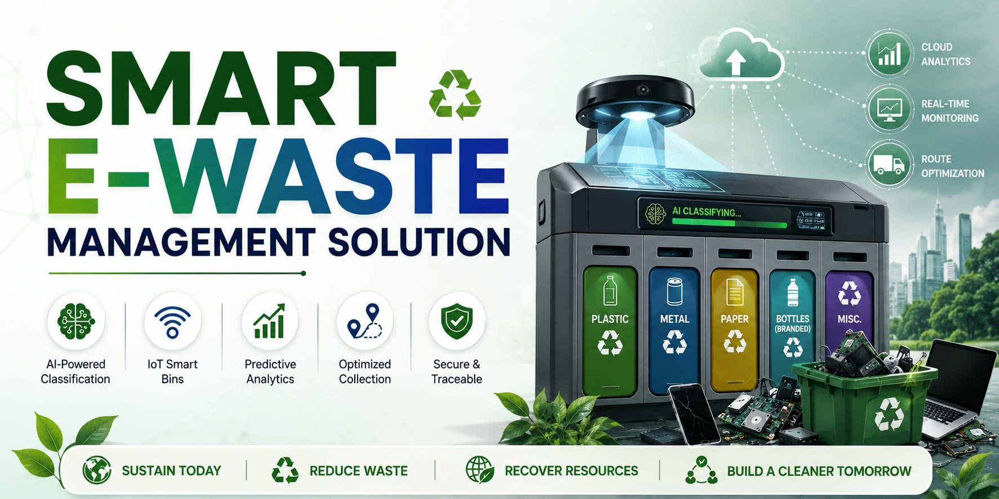
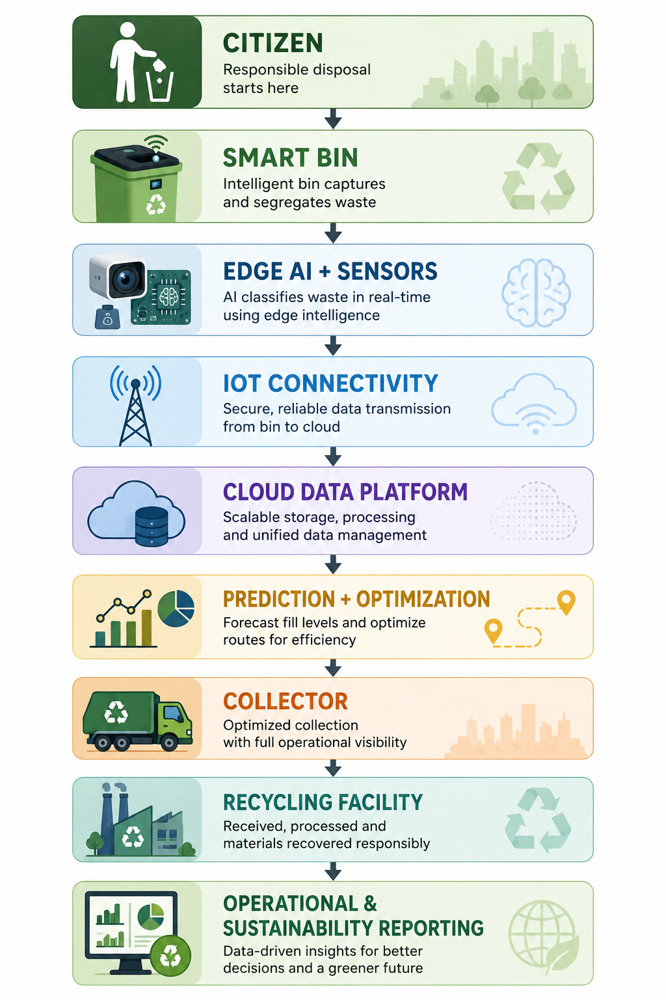
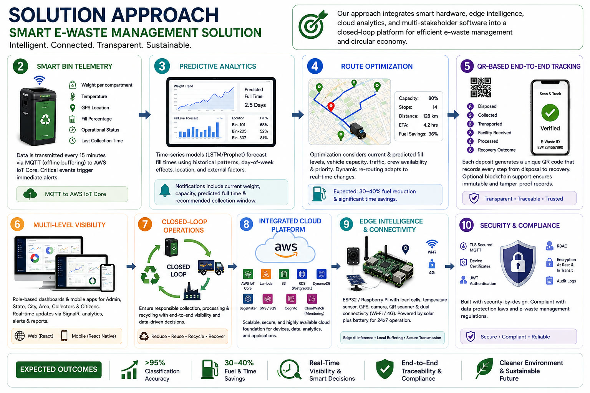
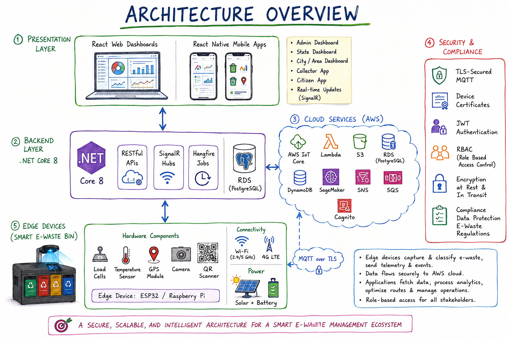

# Case Study 010: Smart E-Waste Management System

*Transforming urban waste operations through IoT, AI, and predictive intelligence.*

| Field                         | Value                                                                                    |
| ----------------------------- | ---------------------------------------------------------------------------------------- |
| **Case**                      | 010                                                                                      |
| **Client / Capability Owner** | EcoTrack Solutions                                                                       |
| **Industry**                  | Smart City / Environmental Infrastructure                                                |
| **Capability**                | IoT + AI waste classification, predictive collection, and end-to-end material tracking   |
| **Engagement Type**           | Business case study (pilot → city-scale projection)                                      |
| **Timeline**                  | ~8 months to pilot; ~3 months live pilot operations                                      |
| **Primary Audience**          | Municipal authorities, waste-management operators, smart-city technology providers       |
| **Stack**                     | React, React Native, .NET Core 8, AWS IoT / SageMaker, TensorFlow Lite, MQTT, PostgreSQL |
| **Status**                    | Publication-ready                                                                        |
| **Screenshots**               | [screenshots/](./screenshots/) — banner, high-level flow, solution overview, architecture |

---

## Executive Summary

Traditional municipal and private waste operations suffer from reactive collection, poor source segregation, limited visibility into material flows, and high operational costs. The Smart E-Waste Management System addresses these issues with an integrated IoT-AI platform featuring intelligent multi-compartment bins, edge-based waste classification, predictive fill forecasting, dynamic route optimization, QR-enabled end-to-end tracking, and multi-tier dashboards.

In a three-month pilot deploying approximately 100 smart bins (with live operational views showing 35+ active units and real-time category breakdowns of plastic, metal, paper, bottles, and miscellaneous), the system delivered 95%+ classification accuracy, a 42% reduction in collection trips, 30–40% fuel savings, an 88% recycling rate, and measurable operational cost reductions of around 35%. Annualized benefits for a 1,000-bin scale are projected at ₹85–115 lakhs against operating costs of ₹60–75 lakhs, supporting a 3–4 year payback and strong five-year ROI.

This case study examines the problem context, solution architecture and implementation, quantified results, strategic lessons, and future implications for municipal authorities, waste-management operators, and smart-city technology providers.

---

## Company Background

EcoTrack Solutions (a technology firm specializing in IoT and AI applications for environmental infrastructure) developed the Smart E-Waste Management System to serve municipalities, private waste contractors, and smart-city programs. The company combines hardware expertise (sensor-equipped bins with edge compute), cloud infrastructure (primarily AWS), backend services (.NET Core), web and mobile front-ends (React and React Native), and machine-learning capabilities (classification and time-series forecasting).

The platform targets the full waste lifecycle—from citizen disposal through collection, transport, facility receipt, and recycling outcome tracking—while supporting hierarchical governance (super admin, state, city, area, collector, citizen, and facility roles). The solution is positioned for both pilot deployments and city-scale rollouts, with explicit attention to data security, regulatory compliance (including e-waste rules and data-protection requirements), and measurable environmental and financial returns.

---

## Challenge Analysis

Urban waste systems face four interlocking problems that drive cost, inefficiency, and environmental leakage.

### Inefficient Collection

Manual or fixed-schedule monitoring produces either overflowing bins or unnecessary trips. Without real-time fill data, operators lack visibility into actual need, resulting in excess fuel use, higher labor hours, and degraded public cleanliness.

### Poor Segregation

Manual sorting is error-prone and slow. Mixed streams sharply reduce recovery rates and increase contamination, lowering the value of recyclables and raising disposal costs.

### Limited Tracking and Accountability

Once material leaves the bin, visibility often disappears. Municipalities and producers struggle to measure true recycling rates, demonstrate Extended Producer Responsibility (EPR) compliance, or quantify environmental impact (CO₂ avoided, material recovered).

### Operational Inefficiencies and Reactive Management

Resource allocation remains largely reactive. Coordination across collectors, supervisors, city administrators, and recycling facilities is fragmented, limiting data-driven decision-making and continuous improvement.

These issues compound in denser urban environments and under tightening environmental regulations. The business impact includes elevated operating expenditure, missed recycling revenue, reputational risk, and slower progress toward circular-economy and smart-city goals. Without intervention, these inefficiencies scale with population growth and rising waste volumes.

---

## Solution Approach

The Smart E-Waste Management System integrates hardware, edge intelligence, cloud services, and multi-stakeholder software into a closed-loop platform—from citizen disposal through edge classification, cloud analytics, optimized collection, and recycling outcomes.

*Figure 1. End-to-end operating flow from responsible disposal to operational and sustainability reporting.*

### Core Technical Pillars

- **Intelligent Waste Classification**: On disposal, a camera and sensors capture image and physical properties. An edge-deployed convolutional neural network (transfer-learned ResNet/EfficientNet, TensorFlow Lite) classifies material into five categories—Plastic, Metal, Paper, Bottles (branded), and Miscellaneous—with reported accuracy exceeding 95%. Waste is directed to the appropriate compartment; weight, timestamp, and classification are logged.
- **Smart Bin Telemetry**: Each bin continuously reports weight per compartment, temperature, GPS location, fill percentage, operational status, and last-collection time. Data is transmitted every 15 minutes via MQTT (with offline buffering) to AWS IoT Core; critical events trigger immediate alerts.
- **Predictive Analytics**: Time-series models (LSTM/Prophet) forecast fill times using historical patterns, day-of-week effects, location, and external factors. Notifications include current weight, capacity, predicted full time, and recommended collection window.
- **Route Optimization**: A vehicle-routing formulation incorporates current and predicted fill levels, vehicle capacity, traffic, crew availability, and priority. Dynamic re-routing responds to real-time changes. Expected outcomes include 30–40% fuel reduction and substantial time savings.
- **QR-Based End-to-End Tracking**: Each deposit generates a unique QR code that records disposal, collection, transport, facility receipt, processing status, and recovery outcomes. Optional blockchain support can provide immutable records.
- **Multi-Level Visibility**: React-based admin, state, city, and area dashboards plus React Native mobile apps for collectors and citizens provide role-appropriate views, real-time SignalR updates, analytics, and alerts.

*Figure 2. Solution approach across hardware, edge intelligence, cloud analytics, and multi-stakeholder software.*

### Architecture Overview

Presentation layer (React web dashboards and React Native apps) communicates with a .NET Core 8 backend (RESTful APIs, SignalR hubs, Hangfire jobs). Cloud services include AWS IoT Core, Lambda, S3, RDS (PostgreSQL), DynamoDB, SageMaker, SNS/SQS, and Cognito. Edge devices use ESP32 or Raspberry Pi with load cells, temperature sensors, GPS, camera, QR scanner, and dual connectivity (Wi-Fi/4G), powered by solar-plus-battery.

*Figure 3. Layered architecture: edge devices, AWS cloud services, .NET Core 8 APIs, and role-based web/mobile clients.*

Security measures encompass TLS-secured MQTT, device certificates, JWT authentication, RBAC, encryption at rest and in transit, and compliance considerations for data-protection and e-waste regulations.

---

## Implementation Process

Deployment followed a phased roadmap spanning roughly eight months to pilot and subsequent scale-up.

| Phase                         | Timeline                        | Focus                                                                                                              |
| ----------------------------- | ------------------------------- | ------------------------------------------------------------------------------------------------------------------ |
| **1 – Foundation**            | Months 1–2                      | IoT prototype, cloud provisioning, database schema, core backend APIs, basic admin dashboard                       |
| **2 – Core Features**         | Months 3–4                      | AI model training (>100,000 image samples), full backend, admin dashboard, initial mobile apps, systematic testing |
| **3 – Advanced Capabilities** | Months 5–6                      | Predictive models, route optimization, multi-level dashboards, QR tracking, advanced reporting                     |
| **4 – Pilot**                 | Month 7 onward (~3 months live) | 50–100 smart bins in selected urban zones; real-world tuning of classification, prediction, and operations         |
| **5 – Scale**                 | Ongoing                         | City-wide expansion, model retraining, feature enhancements, geographic roll-out                                   |

Live operational views during the pilot showed active bins, cumulative weight collected by category, alert status, and individual bin fill levels with color-coded status (Full/Empty).

Change management included role-based training, clear escalation paths for alerts, and integration with existing collection workflows. Hardware installation emphasized weather-resistant enclosures, reliable power, and connectivity. Software followed CI/CD practices with monitoring via CloudWatch and high-availability patterns (multi-AZ, auto-scaling, read replicas).

---

## Results & Metrics

Pilot and projected scaled results provide concrete evidence of impact.

### Operational Efficiency

| Metric                                    | Result                               |
| ----------------------------------------- | ------------------------------------ |
| Classification accuracy                   | 95%+                                 |
| Reduction in unnecessary collection trips | 42% (pilot); ~40% broader projection |
| Route efficiency improvement              | ~50%                                 |
| Fuel savings                              | 30–40%                               |
| Overall operational cost reduction        | ~35% in pilot settings               |

### Environmental and Recovery Outcomes

- Recycling rate achieved: **88%** (pilot); target trajectory toward 85%+.
- Full traceability of material flows.
- Projected CO₂ emission reductions on the order of **35%** through optimized logistics and higher recovery.

### User and System Performance

- User satisfaction in pilot: **98%**.
- System targets: classification <2 seconds, API responses <200 ms, dashboard loads <1 second, 99.9% uptime aspiration, support for 100,000+ bins and high transaction volumes.

### Illustrative Live Dashboard Snapshot

| Signal                 | Value     |
| ---------------------- | --------- |
| Active smart bins      | 35        |
| Total weight collected | 480.60 kg |
| Plastic                | 120.50 kg |
| Metal                  | 85.30 kg  |
| Paper                  | 95.40 kg  |
| Bottles                | 110.20 kg |
| Miscellaneous          | 69.20 kg  |
| Active critical alerts | 0         |

Individual bin statuses ranged from empty to full, confirming real-time visibility and category-level insight.

These figures are drawn from pilot measurements and conservative scaling assumptions; actual results will vary with local waste composition, density, and operational discipline.

### Visual assets (included)

| Figure | File | What it shows |
|--------|------|---------------|
| Banner | [`screenshots/case-study-10-banner.jpg`](./screenshots/case-study-10-banner.jpg) | Product banner — AI classification, IoT bins, predictive collection |
| 1 | [`screenshots/case-study-10-high-level-diagram.jpg`](./screenshots/case-study-10-high-level-diagram.jpg) | Citizen-to-reporting end-to-end flow |
| 2 | [`screenshots/case-study-10-solution-overview.jpg`](./screenshots/case-study-10-solution-overview.jpg) | Ten-pillar solution approach and expected outcomes |
| 3 | [`screenshots/case-study-10-architecture.jpg`](./screenshots/case-study-10-architecture.jpg) | Presentation, backend, AWS, edge, and security layers |

---

## Lessons Learned

Several strategic insights emerged that are transferable to other IoT-enabled municipal systems.

- **Edge intelligence is essential for user experience and reliability.** Performing classification at the bin keeps latency low and allows continued operation during connectivity interruptions. Continuous model improvement using new field data is required to maintain accuracy as waste streams evolve.
- **Predictive rather than purely reactive operations unlock the largest efficiency gains.** Accurate fill-time forecasts enable proactive scheduling and prevent both overflows and wasted trips. Combining historical patterns with real-time signals and external variables (traffic, weather) improves robustness.
- **Multi-stakeholder design and clear role hierarchies accelerate adoption.** Providing appropriate interfaces and permissions for citizens, collectors, supervisors, city and state administrators, and facility managers reduces friction and creates shared accountability.
- **Traceability converts compliance from a burden into a value driver.** QR (and optional blockchain) tracking supports EPR reporting, recycling-rate verification, and potential incentive or carbon-credit programs.
- **Hardware–software co-design and phased piloting de-risk scale-up.** Early real-world testing of power systems, connectivity, sensor durability, and user interaction revealed issues that pure lab testing would have missed. Starting with a manageable number of bins allowed rapid iteration before larger capital commitment.
- **Data quality and governance underpin trust.** Consistent telemetry, clear data-retention and privacy practices, and transparent metrics build confidence among operators and citizens alike.

**Actionable takeaway:** Organizations contemplating similar platforms should invest early in high-quality labeled training data, robust edge hardware validation, and a governance model that aligns incentives across the value chain.

---

## Future Implications

The architecture is designed for progressive expansion. Near-term opportunities include deeper smart-city integration (traffic systems, air-quality correlation), advanced computer-vision capabilities (contamination detection, illegal-dumping identification), predictive maintenance of bins, and gamification or reward mechanisms for citizens. Blockchain-enabled carbon-credit generation and recycling marketplaces can further monetize verified recovery.

Geographic scaling to additional cities and adaptation for industrial, hazardous, or medical waste streams represent natural growth vectors. Vertical expansion into B2B producer platforms and waste-to-energy coordination can broaden the addressable market.

For municipalities and operators, the primary implication is a shift from cost-center waste management to a data-rich, measurable contributor to environmental targets and operational efficiency. For technology providers, the case underscores the value of end-to-end platforms that combine hardware, AI, optimization, and multi-party software rather than point solutions.

Successful replication depends on realistic piloting, attention to local regulatory and infrastructural context, sustained model maintenance, and clear demonstration of both financial and environmental returns. When these conditions are met, intelligent waste systems can deliver cleaner cities, higher material recovery, lower emissions, and a compelling return on investment.